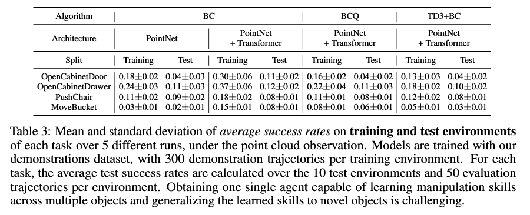

# ManiSkill-Learn

ManiSkill-Learn is a framework for training agents on [SAPIEN Open-Source Manipulation Skill Challenge](https://sapien.ucsd.edu/challenges/maniskill2021/), a physics-rich generalizable manipulation skill benchmark over diverse objects with large-scale demonstrations.

*An important feature of this package is that it supports visual inputs, especially point-cloud inputs.* Such visual data is widely accessable in real-world settings, such as self-driving and robotics. Previous work [link](https://arxiv.org/pdf/1812.07179.pdf) has also found significant performance improvement by using point cloud instead of RGB-D.

ManiSkill-Learn implements various point cloud-based network architectures (e.g. PointNet, PointNet Transformer) adapted to various learning-from-demonstrations algorithms (e.g. Behavior Cloning(BC), Offline/Batch RL([BCQ](https://arxiv.org/pdf/1812.02900.pdf), [CQL](https://arxiv.org/pdf/2006.04779.pdf), [TD3-BC](https://arxiv.org/pdf/2106.06860.pdf))). It is easy for everyone to design new network architectures and new learning-from-demonstrations algorithms, change the observation processing framework, and generate new demonstrations.

Updates:

Nov. 2, 2021: Added some utils for saving trajectories if you want to work on RGB-D inputs.

Aug. 29, 2021: Increased replay buffer capacity in config file if trained with demonstration dataset chunking, as small buffer could cause trajectories in a batch to come from only one training object, which significantly slows down training loss decay.


- [ManiSkill-Learn](#maniskill-learn)
  - [Getting Started](#getting-started)
    - [Installation](#installation)
    - [Simple Workflow](#simple-workflow)
      - [Download Data - Quick Example](#download-data---quick-example)
      - [Evaluation on Simple Pretrained Models](#evaluation-on-simple-pretrained-models)
      - [Train a Simple Agent with Behavior Cloning (BC).](#train-a-simple-agent-with-behavior-cloning-bc)
    - [Download Full Demonstration Data and Pretrained Models](#download-full-demonstration-data-and-pretrained-models)
    - [Download Data from ScienceDB.cn](#download-data-from-sciencedbcn)
    - [Full Training and Evaluation Pipeline](#full-training-and-evaluation-pipeline)
    - [Submit a Model](#submit-a-model)
  - [Demonstrations](#demonstrations)
    - [Demonstrations Format](#demonstrations-format)
    - [Observation Processing](#observation-processing)
    - [Generating Custom Point Cloud Demonstrations](#generating-custom-point-cloud-demonstrations)
    - [Chunking Demonstration Dataset](#chunking-demonstration-dataset)
    - [Generating RGB-D Demonstrations](#generating-rgb-d-demonstrations)
  - [Workflow](#workflow)
    - [Training](#training)
    - [Evaluation](#evaluation)
    - [Challenge Submission](#challenge-submission)
  - [Detailed Functionalities and Config Settings](#detailed-functionalities-and-config-settings)
    - [General Config Settings and Config in Command Line](#general-config-settings-and-config-in-command-line)
    - [General Training / Evaluation Process Management](#general-training--evaluation-process-management)
    - [Learning-from-Demonstrations (LfD) Algorithms](#learning-from-demonstrations-lfd-algorithms)
    - [Network Architectures](#network-architectures)
    - [Environments](#environments)
      - [Configs](#configs)
      - [Getting Environment Info](#getting-environment-info)
    - [Demonstration Loading and Replay Buffer](#demonstration-loading-and-replay-buffer)
    - [Evaluation](#evaluation-1)
  - [Acknowledgements](#acknowledgements)
  - [Citation](#citation)
  - [License](#license)

## Getting Started

### Installation

ManiSkill-Learn requires the python version to be >= 3.6 and torch version to be >= 1.5.0. We suggest users to use `python 3.8` and `pytorch 1.9.0` with `cuda 11.1`. The evaluation system of [ManiSkill challenge](https://sapien.ucsd.edu/challenges/maniskill2021/) uses `python 3.8.10`. To create the corresponding Anaconda environment, run `conda create -n "myenv" python=3.8.10`.

To get started, enter the parent directory of where you installed [ManiSkill](https://github.com/haosulab/ManiSkill) (`mani_skill`) and clone this repo, then install with pip under the same environment where `mani_skill` is installed.

```
cd {parent_directory_of_mani_skill}
conda activate mani_skill #(activate the anaconda env or virtual env where mani_skill is installed)
git clone https://github.com/haosulab/ManiSkill-Learn.git
cd ManiSkill-Learn/
pip install -e .
```

Due to variations in CUDA versions, we did not include pytorch or torchvision in `requirements.txt`. Therefore, please install `torch` and `torchvision` before using this package. A version reference can be found in [this url](https://pytorch.org/get-started/previous-versions/).

### Simple Workflow

#### Download Data - Quick Example

Enter this repo, then download example demonstration data from [Google Drive](https://drive.google.com/drive/folders/1ACnjesy6gerfW5F9RMX-e49dbHz5DPLF) and store the data under ```./example_mani_skill_data```.

#### Evaluation on Simple Pretrained Models

This section provides a simple example of our evaluation pipeline. To evaluate the example pre-trained models, please check the scripts in `scripts/simple_mani_skill_example/eval_bc_example.sh`. For example, you can run

```
python -m tools.run_rl configs/bc/mani_skill_point_cloud_transformer.py \
--gpu-ids=0 --cfg-options "env_cfg.env_name=OpenCabinetDrawer_1045_link_0-v0" \
"eval_cfg.save_video=True" "eval_cfg.num=10" "eval_cfg.use_log=True" \
--work-dir=./test/OpenCabinetDrawer_1045_link_0-v0_pcd \
--resume-from=./example_mani_skill_data/OpenCabinetDrawer_1045_link_0-v0_PN_Transformer.ckpt --evaluation
```

to test the performance of PointNet + Transformer on environment `OpenCabinetDrawer_1045_link_0-v0` in ManiSkill.

#### Train a Simple Agent with Behavior Cloning (BC).

This section provides a simple example of our training pipeline. To train with example demonstration data, please check the scripts in `scripts/simple_mani_skill_example/`. For example, you can run

```
python -m tools.run_rl configs/bc/mani_skill_point_cloud_transformer.py \
--gpu-ids=0 --cfg-options "env_cfg.env_name=OpenCabinetDrawer_1045_link_0-v0" \
--work-dir=./work_dirs/OpenCabinetDrawer_1045_link_0-v0 --clean-up
```

to train PointNet + Transformer with demonstration data generated on `OpenCabinetDrawer_1045_link_0-v0` in ManiSkill.

There can be some noise between different runs (which is very common in RL), so you might want to train multiple times and choose the best model.

### Download Full Demonstration Data and Pretrained Models

The simple examples above only consider training and evaluation on one single object instance, but our challenge aims at training on many object instances and generalizing the learned manipulation skills to novel object instances.

All the data used in this repository is stored on [Google Drive](https://drive.google.com/drive/folders/1KwGz8BlrkZ4CNpAHEo61XBHwULMHU5_z). 

You can download the full point cloud demonstration dataset (which is stored [here](https://drive.google.com/drive/folders/1A7_WsbABXUpTKZiyoSuXpNvpIT-fNRpl)) along with models (which is stored [here](https://drive.google.com/drive/folders/1H28oLQdP4TtsLVN7dQPmdkAO4IjyYTGl)) pre-trained on all of our training object instances. The demonstration data and pre-trained models need to be stored under ```./full_mani_skill_data``` to run the provided scripts in `scripts/full_mani_skill_example`.

If you want to render point cloud demonstrations from state demonstrations by yourself, you can download the demonstration data with environment state [here](https://drive.google.com/drive/u/1/folders/10KlIo7DIyMWUxc_NXarKcjPmaXyKJivo) and put them in `./full_mani_skill_state_data/`. Please read [Demonstrations](#demonstrations) and [Generating Custom Point Cloud Demonstrations](#generating-custom-point-cloud-demonstrations).

You can run ```python tools/check_md5.py``` to check if you download all the files correctly. 

### Download Data from ScienceDB.cn
If you cannot access Google easily, you can download data from [here](http://www.doi.org/10.11922/sciencedb.00034).

### Full Training and Evaluation Pipeline

After you download the full data, you are ready to start the ManiSkill challenge. For the full training and evaluation pipeline, see [Workflow](#workflow).

### Submit a Model

After you train a full model, you can submit it to our ManiSkill challenge. Please see [Challenge Submission](#challenge-submission) in [Workflow](#workflow) for more details.

## Demonstrations
To download our demonstration dataset, please see [Download Full Demonstration Data and Pretrained Models](#download-full-demonstration-data-and-pretrained-models).

This section introduces important details about our point cloud demonstration data. The format of our demonstrations is explained in [Demonstrations Format](#demonstrations-format). The provided point cloud demonstrations are downsampled and processed using an existing processing function, which is explained in more detail in [Observation Processing](#observation-processing). If you want to generate point cloud demonstrations using custom post-processing functions, please refer to [Generating Custom Point Cloud Demonstrations](#generating-custom-point-cloud-demonstrations).

We did not generate RGB-D demonstration since downsampling an RGB-D image can easily lose important information, while downsampling a point cloud is a lot easier. If you want to, please see [Generating RGB-D Demonstrations](#generating-rgb-d-demonstrations).

### Demonstrations Format

The demonstrations are stored in HDF5 format. The point cloud demonstrations have the following structure:

```
>>> from h5py import File
>>> f = File('./example_mani_skill_data/OpenCabinetDrawer_1045_link_0-v0_pcd.h5', 'r')
# f is a h5py.Group with keys traj_0 ... traj_n
>>> f['traj_0'].keys()
<KeysViewHDF5 ['actions', 'dones', 'next_obs', 'obs', 'rewards']>
# Let the length of the trajectory 0 be l,
# then f['traj_0']['actions'] is h5py.Dataset with shape == [l, action_dim]
# f['traj_0']['dones'] is a h5py.Dataset with shape == (l,), and the last element is True
# f['traj_0']['rewards'] is a h5py.Dataset with shape == (l,)
# f['traj_0']['obs'] and f['traj_0']['next_obs'] are h5py.Group,
both have the following structure:
  {
  state: h5py.Dataset, shape (l, state_shape); agent's state, including pose, velocity, angular velocity of the moving platform of the robot, joint angles and joint velocities of all robot joints, positions and velocities of end-effectors
  pointcloud: h5py.Group
    {
    xyz: h5py.Dataset, shape (l, n_points, 3); position for each point, recorded in world frame
    rgb: h5py.Dataset, shape (l, n_points, 3); RGB values for each point
    seg: h5py.Dataset, shape (l, n_points, n_seg); some task-relevant segmentaion masks, e.g. handle of a cabinet door
    }
  }
# For the description of segmentation masks (`seg`) for each task, 
please refer to the ManiSkill repo.
```

You may notice that the structure of `obs` and `next_obs` is different from the raw observation structure of the ManiSkill environments. The raw observation structure of ManiSkill environments can be obtained from running the script below:

```
>>> import mani_skill.env, gym
>>> env=gym.make('OpenCabinetDoor-v0')
>>> env.set_env_mode(obs_mode='pointcloud')
>>> obs=env.reset()
{
  'agent': ... , # a vector that describes agent's state, including pose, velocity, angular velocity of the moving platform of the robot, joint angles and joint velocities of all robot joints, positions and velocities of end-effectors
  'pointcloud': {
    'rgb': ... , # (N, 3) array, RGB values for each point
    'xyz': ... , # (N, 3) array, position for each point, recorded in world frame
    'seg': ... , # (N, k) array, some task-relevant segmentaion masks, e.g. handle of a cabinet door
  }
}
```

Our demonstration data has the following differences. The differences are due to the observation post-processing function in `mani_skill_learn/env/observation_process.py` called by the Gym environment wrapper (`mani_skill_learn/env/wrappers.py`), which is explained in more detail in [Observation Processing](#observation-processing).

- The demonstrations are downsampled and processed from the raw point cloud when utilizing the wrapper (see [Observation Processing](#observation-processing)). Therefore, our demonstration has much fewer points (`l=1200`) than the raw point cloud (`N=160*400*3`).
- The `state` key in our demonstration corresponds to the `agent` key in the raw observation of the ManiSkill environments. An important thing to keep in mind is that the vector only represents the robot state of the agent and does not contain ground truth information of the environment (i.e. does not contain information such as object location, distance from the robot to the object, etc, and such information should be inferred from the point cloud)

Even though our demonstration format differs from the raw observation structure of ManiSkill environments, since our environments are wrapped by the `SapienRLWrapper` class in `mani_skill_learn/env/wrappers.py`, and we always utilize  the wrapper to call the observation processing function whenever we advance a step in the environment and obtain the corresponding observations (i.e. `observation, reward, done, info = env.step(action)`) during model inference, we do *NOT* need to do anything special in our repo.

### Observation Processing

For demonstration generation, online data collection, and model inference, the observation processing is done in the environment wrappers in `mani_skill_learn/env/wrapper.py`. For ManiSkill environments, the wrapper calls `process_sapien_rl_base` in `mani_skill_learn/env/observation_process.py` to downsample and process the raw point cloud. In our implementation, we selectively downsample from 160\*400\*3 points to 1200 points. Specifically, for each dimension of the segmentation mask, we first sample 50 points where the mask is True (if there are fewer than 50 points, then we keep all the points). We then randomly sample from the rest of points where at least one of the segmentation masks is true, such that we obtain a total of 800 points (if there are fewer than 800, then we keep all of them). Finally, we randomly sample from the points where none of the segmentation masks are true and where the points are not on the ground (i.e. have positive $z$-coordinate value), such that we obtain a total of 1200 points. 

Point clouds in the demonstration data we provided have already been processed by `process_sapien_rl_base` our repo. If you want to write custom processing function and you want to use any demonstration data during training, you need to first re-render the demonstrations. See [Generating Custom Point Cloud Demonstrations](#generating-custom-point-cloud-demonstrations).

### Generating Custom Point Cloud Demonstrations

To generate custom point cloud demonstrations using custom post-processing functions (by replacing `process_sapien_rl_base`, see [Observation Processing](#observation-processing)), we have provided demonstrations containing all the necessary information to precisely reconstruct the environment at each time step. You should have downloaded the files in `./full_mani_skill_state_data/`

The demonstration has the following format:

```
>>> from h5py import File
>>> f = File(path, 'r')
>>> f.keys()
dict_keys(['actions', 'dones', 'env_levels', 'env_scene_states', 
'env_states', 'episode_dones', ... , 'next_env_scene_states', 
'next_env_states', 'next_obs', 'obs', 'rewards'])
```

<!-- Here `env_states` is the environment's internal state (unable to be seen by an agent during training), and `env_levels` is the unique identifier of the object. -->
The API for rendering and converting the above demonstration to point cloud data is provided in `tools/convert_state.py`.

To run `convert_state.py`, example script is provided in `scripts/simple_mani_skill_example/convert_state_to_pcd.sh`. The script generates point cloud for only one of the environments, so you need to repeat so for all environments (see `available_environments.txt` in the ManiSkill repo).

### Chunking Demonstration Dataset
The sum of size of generated point cloud demonstrations for all environments of a task is larger than 10G. After loading and converting into internal dataset, the total consumed memory during agent training will be 60 - 120G. If your computer does not have enough memory, you can use a chunked dataset. Please refer to [Demonstration Loading and Replay Buffer](#demonstration-loading-and-replay-buffer) for more details.

### Generating RGB-D Demonstrations

We did not provide pre-generated RGB-D demonstrations because, unlike point cloud demonstrations, they cannot be easily downsampled without losing important information, which means they have a much larger size and would be in the scale of terabytes (300 trajs/env \* 170 training envs \* about 30 steps per traj \* 160 \* 400 \* 3 \* 4 \* 4bytes/float = 4.7TB). If you would like to train models using RGB-D demonstrations, you could use `tools/convert_state.py` by passing `--obs_mode=rgbd` to generate the demonstrations. In addition, you need to also implement custom network architectures that process RGB-D images (see "Network Architectures" below).

To compress RGB-D images when saving demo trajectories, here we provide some utils:

```
import numpy as np, cv2, base64

def compress_image(x, depth=False):
    # Image only
    if x.dtype == np.float64:
        x = x.astype(np.float32)
    if x.dtype == np.float32:
        if not depth:
            x = np.clip((x * 255).astype(np.int), a_min=0, a_max=255).astype(np.uint8)
            return x
        else:
            # Assume 0 <= x <= 1 and real depth = (1 - x) * 1/near + x * 1/far.
            # x = np.clip(((x - 0.5) * 32767).astype(np.int), a_min=-32767, a_max=32767).astype(np.int16)
            x = np.clip((x * 65535).astype(np.int), a_min=0, a_max=65535).astype(np.uint16)
            return x
    return x


def decompress_image(x):
    if x.dtype == 'uint8':
        return x / 255
    elif x.dtype == 'uint16':
        return x / 65535
    else:
        return x
        
def compress_obs(obs, compress_type='maniskill-rgbd'):
    
    def imencode(img, format='.png', binary=True):
        ret =  cv2.imencode(format, img)[1]
        if binary:
            ret = base64.binascii.b2a_base64(ret)
        return ret
        
    if compress_type == 'maniskill-rgbd':
        rgbd = obs['rgbd']
        rgb = rgbd['rgb']
        depth = rgbd['depth']
        seg = rgbd['seg']

        num_image = depth.shape[-1]
        assert num_image * 3 == rgb.shape[-1]
        rgb = np.split(rgb, num_image, axis=-1)
        depth = np.split(depth, num_image, axis=-1)
        seg = np.split(seg, num_image, axis=-1)
        assert seg[0].shape[-1] <= 8
        
        # Concat all boolean mask of segmentation and add the one 
        seg = [np.packbits(np.concatenate([_, np.ones_like(_[..., :1])], axis=-1), axis=-1, bitorder='little') for _ in seg]
        seg = [imencode(_) for _ in seg]
        rgb = [imencode(_) for _ in rgb]
        depth = [imencode(_) for _ in depth]    
        obs['rgbd'] = {'rgb': rgb, 'depth': depth, 'seg': seg}
        return obs
    else:
        raise NotImplementedError()


def decompress_obs(obs, compress_type='maniskill-rgbd', **kwargs):
    
    def imdecode(sparse_array):
        if isinstance(sparse_array, (bytes, np.void)):
            sparse_array = np.frombuffer(base64.binascii.a2b_base64(sparse_array), dtype=np.uint8)
        return cv2.imdecode(sparse_array, -1)

    if compress_type == 'maniskill-rgbd':
        rgbd = obs['rgbd']
        rgb = rgbd['rgb']
        depth = rgbd['depth']
        seg = rgbd['seg']
        seg = [imdecode(_[0])[..., None] for _ in seg]
        num_segs = int(seg[0][0, 0, 0]).bit_length() - 1
        seg = np.concatenate([np.unpackbits(_, axis=-1, count=num_segs, bitorder='little') for _ in seg], axis=-1).astype(np.bool)
        rgb = np.concatenate([imdecode(_[0]) for _ in rgb], axis=-1)
        depth = np.concatenate([imdecode(_[0])[..., None] for _ in depth], axis=-1)  # uint16
        obs['rgbd'] = {'rgb': rgb, 'depth': depth, 'seg': seg}
        return obs  
    else:
        raise NotImplementedError()

```

## Workflow

### Training

We have provided example training scripts in `scripts/full_mani_skill_example/`. **If you want to directly evaluate a pretrained model (such as those we provided), see [Evaluation](#evaluation).**

To train an agent, run `tools/run_rl.py` with appropriate arguments. Among the arguments, `config` requires a user to specify a path to the config file. `cfg-options` overrides some configs in an existing config file. The config file specifies information regarding the algorithm, the hyperparameters, the network architectures, the training process, and the evaluation process. 
For more details about the config, see [Detailed Functionalities and Config Settings](#detailed-functionalities-and-config-settings). Example config files for learning-from-demonstrations algorithms are in `configs/`.

**There can be some noise between different runs (which is very common in RL), so you might want to train multiple times and choose the best model.**

If you are interested in designing any custom functionalities, such as writing custom Reinforcement Learning algorithms / training pipelines or designing custom network architectures, please also see [Detailed Functionalities and Config Settings](#detailed-functionalities-and-configs-settings) for specific information.

If you are interested in designing custom computer vision architectures which map point cloud input to action output, please also pay attention to [Demonstrations Format](#demonstrations-format), [Observation Processing](#observation-processing), and [Network Architectures](#network-architectures).

### Evaluation

Evaluating an agent can be done during training or using an existing model.

To evaluate an agent during training, run `tools/run_rl.py` with appropriate configs (see the [Evaluation](#evaluation-1) config settings below).

To evaluate an agent solely through an existing model, set appropriate `eval_cfg` and run `tools/run_rl.py` with `--evaluation` and `--resume-from` options.

Example evaluation scripts using existing pretrained models can be found in `scripts/full_mani_skill_example/`.

### Challenge Submission

To create a submission for the ManiSkill challenge, please read the instructions in [mani-skill-submission-example](https://github.com/haosulab/ManiSkill-Submission-Example) first.

If you want to include functionalities in our ManiSkill-Learn repo for your submission, example `user_solution.py` and `environment.yml` can be found in the `submission_example` directory. In this case, please first move these files directly under the repo (i.e. move them to `{this_repo}/user_solution.py` and `{this_repo}/environment.yaml`). Also please ensure that the correct versions of `torch` and `torchvision` are in `environment.yml`.

Before submitting to our server, you can utilize the ManiSkill (local) evaluation tool to ensure that things are set up correctly (please refer to "Evaluation" section in the ManiSkill repo).

Here is a reference performance table for our baseline algorithms implemented in ManiSkill-Learn (note that standard deviation in this table is the standard deviation between the *mean success rates* of different runs, while the standard deviation reported when running our evaluation scripts is with regard to the values of the success indicator variable in different trajectories in one single run):



## Detailed Functionalities and Config Settings

This section introduces different modules and functionalities in ManiSkill-Learn, along with how the config settings are parsed in our scripts. This section is especially useful if you want to implement any new functionalities or make changes to the default config settings we have given.

### General Config Settings and Config in Command Line

At a high level, the configs for learning-from-demonstrations algorithms are in `configs/`.
The `configs/_base_/` subdirectory contains configs that can be reused across different environments, such as network architectures and evaluation configs. To train or evaluate an agent, run `tools/run_rl.py` with appropriate arguments and path to the config file (`--config=path_to_config_file`).

The config files are processed as iterated dictionaries when running `tools/run_rl.py`, with rules as follows: when a config file is imported as `_base_` config in another config file, in case there is a conflict in the value of the same dictionary key in the two files, the value in the latter file overrides the value in the former file. If the latter file contains dictionary keys which the `_base_` config doesn't have, then the keys are merged together.

One can also specify `cfg-options` in the command lines when running `tools/run_rl.py`. In this case, the configs passed to the command line override the existing configs in the config files.

### General Training / Evaluation Process Management

During training, `tools/run_rl.py` calls `mani_skill_learn/apis/train_rl.py` to manage the training process, evaluation during training, and result logging. `mani_skill_learn/apis/train_rl.py` calls the implementations in `mani_skill_learn/methods/` for algorithm-specific model forward functions and parameter update functions. These functions then invoke files under `mani_skill_learn/networks/policy_network/` for forwarding policy networks and `mani_skill_learn/networks/value_network/` for forwarding value networks (if the algorithm has them). When evaluating during training, `mani_skill_learn/apis/train_rl.py` calls the evaluator in `mani_skill_learn/env/evaluation.py`.

During evaluating pre-trained models, `tools/run_rl.py` directly calls the evaluator in `mani_skill_learn/env/evaluation.py`.

### Learning-from-Demonstrations (LfD) Algorithms

We implemented several learning-from-demonstration algorithms in `mani_skill_learn/methods/`: BC (Behavior Cloning), BCQ (Batch-Constrained Q-Learning), CQL (Conservative Q-Learning), and TD3+BC.

Besides learning-from-demonstrations algorithms, we also provide implementations of online model-free agents such as SAC and TD3 (which don't use any demonstration data) in `mani_skill_learn/methods/mfrl/`.

The algorithm hyperparameters, along with the policy and value network architectures, are specified in the `agent` entry in the config files. The `train_mfrl_cfg` entry specifies training parameters. Specifically,

- `total_steps` is the total number of training gradient steps.
- For replay buffer related configs, i.e. `init_replay_buffers` and `init_replay_with_split`, please see [Demonstration Loading and Replay Buffer](#demonstration-loading-and-replay-buffer). The reason we call the data structure for storing loaded demonstration data "replay buffer" is that we can share the LfD algorithm interface with the online algorithm interface; in pure imitation learning / offline RL settings, since we are not collecting online data and adding it to the replay buffer, when we load the demonstrations, the replay buffer becomes the entire dataset.
- `n_steps` is set to 0 for pure imitation learning / offline settings. If one wants to combine offline algorithms with online data collection, then one needs to set some nonzero `n_steps` similar to the configs in `configs/mfrl/`. In addition, `rollout_cfg` needs to be set, `agent.policy` needs to be implemented explicitly for algorithms, and you might also want to change the implementation of replay buffer (since the original demonstrations might be overwritten when the number of samples reaches the buffer capacity). However, keep in mind that online data collection is expensive in point cloud setting.
- `n_updates` refers to the number of agent updates for every sampled batch.
- `num_trajs_per_demo_file` refers to the number of trajectories to load per demo file, 

### Network Architectures

Our network architectures are implemented in `mani_skill_learn/networks`. The `mani_skill_learn/networks/backbones` directory contains point cloud-based architectures such as PointNet and PointNet + Transformer. These specific architectures are built from configs during the policy and value network building processes.

We did not implement RGB-D based architectures because the RGB-D demonstrations would be a lot larger than the point cloud demonstrations (since downsampling an RGB-D image can easily lose important information, while downsampling a point cloud is a lot easier). Thus you need to implement custom image-based architectures if you want to train a model using RGB-D demonstrations.

Architecture-specific configurations are specified in the `agent/{policy or value network}/nn_cfg` entries of the config files. Note that some algorithms have multiple policy or value networks.

During model training, the inputs to the model (sampled from the replay buffer, see `init_replay_buffers`) have the following format (which is different from the raw observation structure in ManiSkill environments, recall [Demonstrations Format](#demonstrations-format)):

```
let b = batch_size
dict(
  actions: (b, action_dim)
  dones: (b,)
  rewards: (b,)
  obs: dict(
    state: (b, state_shape)
    pointcloud: dict(
      xyz: (b, n_points, 3)
      rgb: (b, n_points, 3)
      seg: (b, n_points, n_seg)
    )
  )
  next_obs has the same format as obs 
)
```

During model inference, the inputs to the model have the following format (since we are not training the model, we don't have information such as `next_obs`):

```
let b = batch_size
dict(
  obs: dict(
    state: (b, state_shape)
    pointcloud: dict(
      xyz: (b, n_points, 3)
      rgb: (b, n_points, 3)
      seg: (b, n_points, n_seg)
    )
  )
  actions: (b, action_dim)
)
```

### Environments

Source files for the environment utilities are stored in `mani_skill_learn/env/`.

#### Configs

In the config file, environment-related configurations can be set similar to the format below:

```
env_cfg = dict(
  type='gym',
  unwrapped=False,
  stack_frame=1,
  obs_mode='pointcloud',
  reward_type='dense',
  env_name={env_name},
)
```

Here `stack_frame` refers to the number of observation frames to stack (similar to Atari, except that we are now working in a point cloud). `env_name` refers to the environment name. Other arguments are typically unchanged.

#### Getting Environment Info

The environment info can be obtained through the script below. Note that the environment is wrapped and the point cloud observation has been post-processed.

```
>>> from mani_skill_learn.env import get_env_info
>>> env = gym.make(env_name)
>>> env.set_env_mode(obs_mode='pointcloud')
>>> obs_shape, action_shape, action_space = \
get_env_info({'env_name': env_name, 'obs_mode': 'pointcloud', 'type': 'gym'})
>>> obs_shape
{'pointcloud': {'rgb': (1200, 3), 'xyz': (1200, 3), 'seg': (1200, 3)}, 'state': some_int1}
>>> action_shape
some_int2
>>> action_space
Box(-1.0, 1.0, (some_int2,), float32)
```

### Demonstration Loading and Replay Buffer

We have provided functionalities on loading demonstrations into the replay buffer in `mani_skill_learn/env/replay_buffer.py`. During agent training, the replay buffer is loaded through `buffer.restore` in `mani_skill_learn/apis/train_rl.py`. The raw utilities on HDF5 file operations are in `mani_skill_learn/utils/fileio/h5_utils.py`.

Config for the replay buffer is set in both `train_mfrl_cfg` and `replay_cfg` entries. In `train_mfrl_cfg`, `init_replay_buffer` refers to the path to a single demonstration data / a list of demonstration data/directory to the chunked datasets (see the paragraphs below for explanations) to be loaded into the replay buffer. `init_replay_with_split` takes a list of exactly two strings, where the first string is the directory of the demonstration dataset, and the second string is the path to the YAML file containing a list of training door/drawer/chair/bucket environment ids (refer to `scripts/full_mani_skill_example/` for examples). This argument loads all demonstration files that correspond to the environment indices in the second file, under the directory specified by the first file. One should only use one of `init_replay_buffer` or `init_replay_with_split` arguments. You may set `init_replay_buffer=''` to ignore it.

For `replay_cfg`, the `capacity` config refers to the limit on the number of (observation, action, reward, next_observation, info) samples. The `type` config specifies the type of replay buffer (`ReplayMemory` if loading all demonstration data into the replay buffer at once and/or doing any online sampling; `ReplayDisk` if loading only a chunk of demonstration data as we go in order to save memory, in this case, we need to set a smaller `capacity` that is divisible by the batch size)

If your computer does not have enough memory to load all demonstrations at once, you can generate a chunked dataset by using `tools/split_datasets.py`. The demonstrations from different environments will be randomly shuffled and stored into several files under the specified folder. To load a chunked dataset for agent training, you need let `replay_cfg.type='ReplayDisk'` and `train_mfrl_cfg.init_replay_buffers='the folder that stores the chunked dataset'`. To find more details, you can check out `configs/bc/mani_skill_point_cloud_transformer_disk.py`. Example scripts are in `scripts/simple_mani_skill_example/run_with_chunked_dataset.sh` and `scripts/full_mani_skill_example/run_with_chunked_dataset.sh`.

### Evaluation

Most of evaluation configs are specified in the `eval_cfg` entry in the config files. Inside the entry, the `num` parameter specifies the number of trajectories to evaluate per environment. The `num_proc` parameter controls the parallelization.

In addition, the `n_eval` parameter in the `train_mfrl_cfg` entry specifies the number of gradient steps between two evaluations during agent training (if `n_eval = None` then no evaluation is performed during training). Use `save_video=True` if you want to see the video generated by the trained agent. *It may slow down the evaluation speed.*

## Acknowledgements

Some functions (e.g. config system, checkpoint) are adopted from [MMCV](https://github.com/open-mmlab/mmcv):

## Citation

```
@article{mu2021maniskill,
  title={ManiSkill: Learning-from-Demonstrations Benchmark for Generalizable Manipulation Skills},
  author={Mu, Tongzhou and Ling, Zhan and Xiang, Fanbo and Yang, Derek and Li, Xuanlin, and Tao, Stone and Huang, Zhiao and Jia, Zhiwei and Su, Hao},
  journal={arXiv preprint arXiv:2107.14483},
  year={2021}
}
```

## License
ManiSkill-Learn is released under the Apache 2.0 license, while some specific operations in this library are with other licenses.
